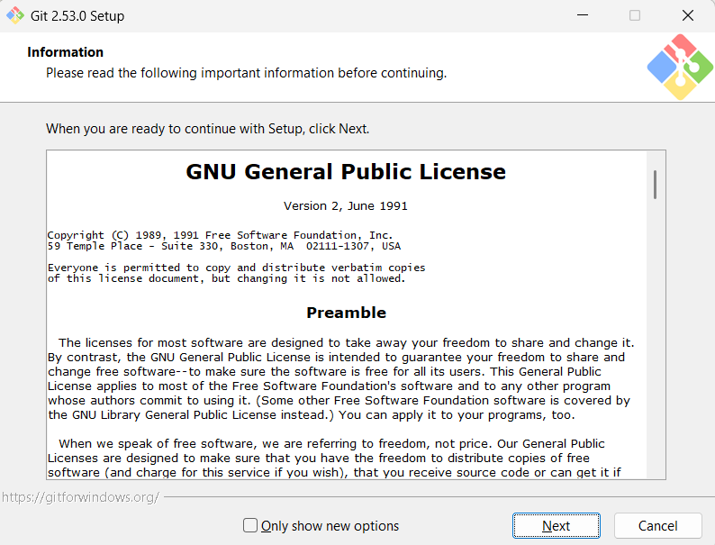
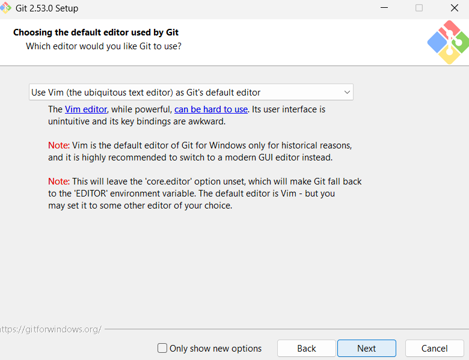
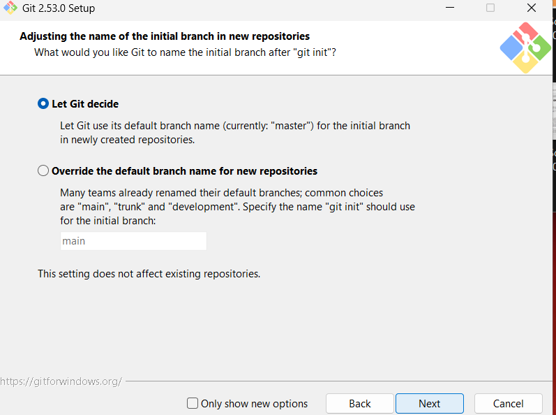
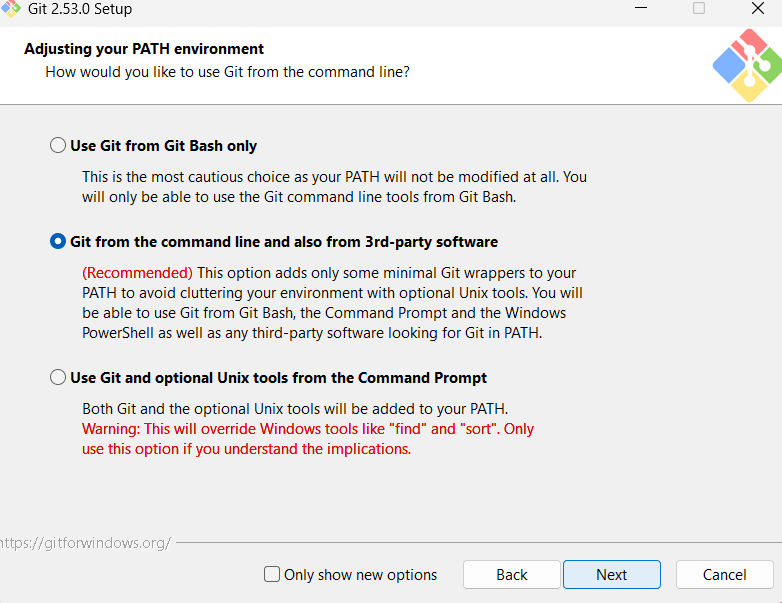
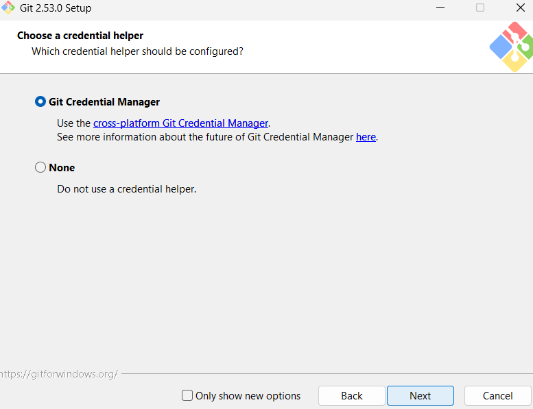
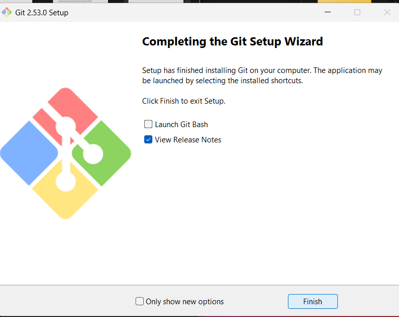
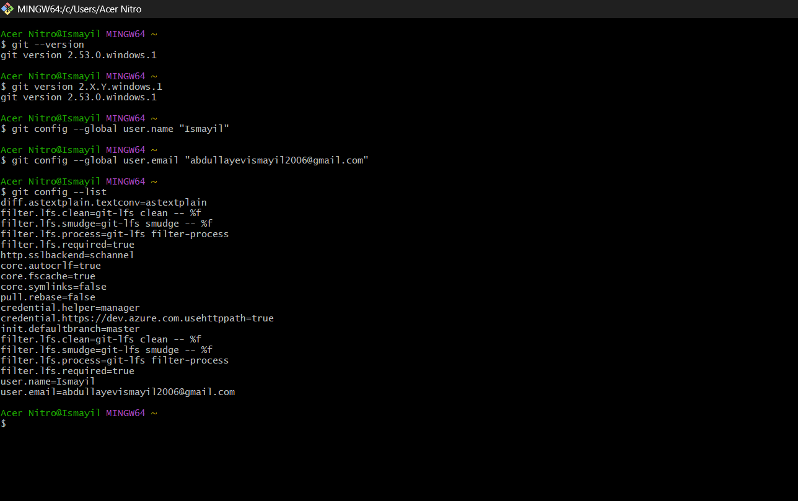

### 1. This license ensures that Git remains free and open-source software, allowing users to run, study, share, and modify the software.

### 2. The installer asks me to select a text editor for Git to use when I need to write commit messages or resolve merge conflicts.

### 3. This determines what the primary branch will be called when you I git init.

### 4.  It decides how Git is integrated into the system's command line.

### 5. This step configures how Git handles login credentials (username and password/token) for services like GitHub.

### 6. This is the final screen of the installation process, indicating that Git has been successfully installed on computer.

### 7.After installation, I must introduce myself to Git(Global Identity)

